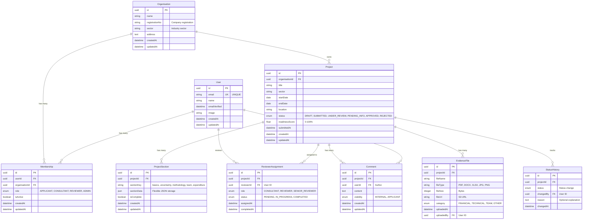

# DSTI Platform - Entity Relationship Diagram (ERD)

**Project**: DSTI R&D Tax Incentive Application Management System  
**Date**: January 21, 2026  
**Database**: PostgreSQL 16 (via Neon)

---

## Database Schema - Entity Relationship Diagram



---

## Detailed Entity Descriptions

### 1. User
**Purpose**: Stores all system users (applicants, consultants, reviewers, admins)

**Attributes**:
- `id` (UUID, PK): Unique identifier
- `email` (VARCHAR, UNIQUE): Email address (used for authentication)
- `name` (VARCHAR, nullable): User's full name
- `emailVerified` (TIMESTAMP, nullable): When email was verified
- `image` (TEXT, nullable): Profile picture URL
- `createdAt` (TIMESTAMP): Account creation date
- `updatedAt` (TIMESTAMP): Last profile update

**Relationships**:
- Has many `Membership` records (user can belong to multiple organisations)
- Has many `Comment` records (user can comment on applications)
- Has many `ReviewerAssignment` records (if user is a reviewer)

**Indexes**:
- Primary key on `id`
- Unique index on `email`

**Business Rules**:
- Email must be unique across all users
- Email verification required before full access
- User accounts are soft-deleted (isActive flag in Membership)

---

### 2. Organisation
**Purpose**: Stores company/organisation information

**Attributes**:
- `id` (UUID, PK): Unique identifier
- `name` (VARCHAR): Organisation name
- `registrationNo` (VARCHAR): Company registration number (e.g., 2020/123456/07)
- `sector` (VARCHAR): Industry sector (Manufacturing, ICT, Agriculture, etc.)
- `address` (TEXT): Physical address
- `createdAt` (TIMESTAMP): Record creation date
- `updatedAt` (TIMESTAMP): Last update

**Relationships**:
- Has many `Membership` records (multiple users can belong to one organisation)
- Has many `Project` records (organisation can submit multiple applications)

**Indexes**:
- Primary key on `id`
- Index on `registrationNo` (for lookups)

**Business Rules**:
- Organisation is auto-created for first-time users (temporary pattern)
- Registration number must be provided for submission (validated later)
- Sector must match DSTI's predefined list

---

### 3. Membership
**Purpose**: Many-to-many relationship between User and Organisation with role information

**Attributes**:
- `id` (UUID, PK): Unique identifier
- `userId` (UUID, FK): Reference to User
- `organisationId` (UUID, FK): Reference to Organisation
- `role` (ENUM): User's role in this organisation
  - `APPLICANT`: Can create/edit applications for this organisation
  - `CONSULTANT`: DSTI staff who screens applications
  - `REVIEWER`: DSTI staff who reviews applications
  - `ADMIN`: System administrator
- `isActive` (BOOLEAN): Whether this membership is currently active
- `createdAt` (TIMESTAMP): When user joined organisation
- `updatedAt` (TIMESTAMP): Last role/status update

**Relationships**:
- Belongs to `User`
- Belongs to `Organisation`

**Indexes**:
- Primary key on `id`
- Unique constraint on `(userId, organisationId)` (prevent duplicate memberships)
- Index on `userId` (fast lookup of user's organisations)
- Index on `organisationId` (fast lookup of organisation's members)

**Business Rules**:
- A user can have multiple memberships (e.g., consultant for DSTI, applicant for their company)
- A user can have only one active membership per organisation
- Role determines permissions within the system
- Deleting user or organisation cascades to delete membership

---

### 4. Project
**Purpose**: Stores R&D project/application information

**Attributes**:
- `id` (UUID, PK): Unique identifier
- `organisationId` (UUID, FK): Which organisation submitted this application
- `title` (VARCHAR): Project title/name
- `sector` (VARCHAR, nullable): Industry sector (may differ from organisation's main sector)
- `startDate` (DATE, nullable): Project start date
- `endDate` (DATE, nullable): Project end date
- `location` (VARCHAR, nullable): Where R&D activities take place
- `status` (ENUM): Current application status
  - `DRAFT`: Being prepared by applicant
  - `SUBMITTED`: Submitted for review
  - `UNDER_REVIEW`: Being reviewed by consultant/reviewer
  - `PENDING_INFO`: Waiting for additional information from applicant
  - `APPROVED`: Application approved
  - `REJECTED`: Application rejected
- `readinessScore` (FLOAT, nullable): AI-calculated score (0-100%)
- `submittedAt` (TIMESTAMP, nullable): When application was submitted
- `createdAt` (TIMESTAMP): Record creation date
- `updatedAt` (TIMESTAMP): Last update

**Relationships**:
- Belongs to `Organisation`
- Has many `ProjectSection` records (5 sections: basics, uncertainty, methodology, team, expenditure)
- Has many `EvidenceFile` records (uploaded documents)
- Has many `StatusHistory` records (audit trail of status changes)
- Has many `ReviewerAssignment` records (who reviewed this application)
- Has many `Comment` records (internal notes and applicant communication)

**Indexes**:
- Primary key on `id`
- Index on `organisationId` (fast lookup of organisation's projects)
- Index on `status` (filter by status)
- Index on `submittedAt` (sort by submission date)

**Business Rules**:
- Project starts in DRAFT status
- Cannot submit if readiness score < 70% (business rule, not database constraint)
- Deleting organisation cascades to delete projects
- Status can only transition in specific ways (enforced at application level)

---

### 5. ProjectSection
**Purpose**: Stores wizard step data using flexible JSON storage

**Attributes**:
- `id` (UUID, PK): Unique identifier
- `projectId` (UUID, FK): Which project this section belongs to
- `sectionKey` (VARCHAR): Section identifier
  - `basics`: Step 1 (title, sector, dates, location)
  - `uncertainty`: Step 2 (R&D uncertainty description, objectives)
  - `methodology`: Step 3 (research approach, innovation, challenges)
  - `team`: Step 4 (team size, personnel, qualifications)
  - `expenditure`: Step 5 (budget, R&D costs, timeline)
- `sectionData` (JSONB): Flexible JSON storage for form fields
- `isComplete` (BOOLEAN): Whether this section is fully filled and validated
- `createdAt` (TIMESTAMP): When section was first saved
- `updatedAt` (TIMESTAMP): Last update (for auto-save tracking)

**Relationships**:
- Belongs to `Project`

**Indexes**:
- Primary key on `id`
- Unique constraint on `(projectId, sectionKey)` (prevent duplicate sections)
- Index on `projectId` (fast lookup of project's sections)
- GIN index on `sectionData` (for JSON queries, if needed)

**Business Rules**:
- One project can have max 5 sections (one per sectionKey)
- Upsert pattern used to prevent duplicates
- JSON structure varies by sectionKey but is validated at application level
- Deleting project cascades to delete sections

**Example sectionData (basics)**:
```json
{
  "title": "AI-Powered Predictive Maintenance System",
  "sector": "Manufacturing",
  "startDate": "2025-01-15",
  "endDate": "2026-06-30",
  "location": "Cape Town, Western Cape"
}
```

---

### 6. EvidenceFile (Planned - Week 3)
**Purpose**: Stores metadata for uploaded evidence documents

**Attributes**:
- `id` (UUID, PK): Unique identifier
- `projectId` (UUID, FK): Which project this evidence belongs to
- `fileName` (VARCHAR): Original file name
- `fileType` (VARCHAR): MIME type or extension (PDF, DOCX, XLSX, JPG, PNG)
- `fileSize` (INT): File size in bytes
- `fileUrl` (TEXT): S3 URL or object key
- `category` (ENUM): Evidence category
  - `FINANCIAL`: Budgets, invoices, financial statements
  - `TECHNICAL`: Research reports, patents, technical specifications
  - `TEAM`: CVs, qualifications, certifications
  - `OTHER`: Miscellaneous supporting documents
- `uploadedAt` (TIMESTAMP): Upload timestamp
- `uploadedBy` (UUID, FK): User who uploaded (for audit trail)

**Relationships**:
- Belongs to `Project`
- References `User` (who uploaded)

**Indexes**:
- Primary key on `id`
- Index on `projectId` (fast lookup of project's files)
- Index on `category` (filter by type)

**Business Rules**:
- Files stored in S3-compatible object storage (not database)
- Only URL/metadata stored in database
- Max file size: 50MB per file
- Files cannot be edited after upload (immutable)
- Files deleted when project is deleted (cascade) or via lifecycle policy

---

### 7. StatusHistory (Planned - Week 4)
**Purpose**: Audit trail of all application status changes

**Attributes**:
- `id` (UUID, PK): Unique identifier
- `projectId` (UUID, FK): Which project's status changed
- `status` (ENUM): New status (same values as Project.status)
- `changedBy` (UUID, FK): User who triggered the change
- `reason` (TEXT, nullable): Optional explanation (e.g., rejection reason)
- `changedAt` (TIMESTAMP): When the change occurred

**Relationships**:
- Belongs to `Project`
- References `User` (who made the change)

**Indexes**:
- Primary key on `id`
- Index on `projectId` (fast lookup of project's history)
- Index on `changedAt` (sort chronologically)

**Business Rules**:
- Immutable (no updates or deletes)
- New record created every time status changes
- Used for reporting (e.g., average time in each status)
- Deleting project cascades to delete history

---

### 8. ReviewerAssignment (Planned - Week 4)
**Purpose**: Tracks which DSTI staff are assigned to review which applications

**Attributes**:
- `id` (UUID, PK): Unique identifier
- `projectId` (UUID, FK): Which application
- `reviewerId` (UUID, FK): Which user (must have CONSULTANT or REVIEWER role)
- `role` (ENUM): Reviewer type
  - `CONSULTANT`: Initial screener
  - `REVIEWER`: Detailed technical reviewer
  - `SENIOR_REVIEWER`: Final decision maker
- `status` (ENUM): Review status
  - `PENDING`: Assigned but not started
  - `IN_PROGRESS`: Currently reviewing
  - `COMPLETED`: Review completed, recommendation made
- `assignedAt` (TIMESTAMP): When reviewer was assigned
- `completedAt` (TIMESTAMP, nullable): When review was completed

**Relationships**:
- Belongs to `Project`
- Belongs to `User` (reviewer)

**Indexes**:
- Primary key on `id`
- Index on `projectId` (fast lookup of project's reviewers)
- Index on `reviewerId` (fast lookup of reviewer's assigned applications)
- Index on `status` (filter by review status)

**Business Rules**:
- One project can have multiple reviewers (consultant + reviewer + senior reviewer)
- One reviewer can have multiple assignments (workload)
- Cannot assign non-DSTI staff as reviewers (enforced at application level)
- Deleting project cascades to delete assignments

---

### 9. Comment (Planned - Week 4)
**Purpose**: Stores internal notes and communication between DSTI staff and applicants

**Attributes**:
- `id` (UUID, PK): Unique identifier
- `projectId` (UUID, FK): Which application
- `userId` (UUID, FK): Who wrote the comment
- `content` (TEXT): Comment text
- `visibility` (ENUM): Who can see this comment
  - `INTERNAL`: Only DSTI staff (consultant/reviewer notes)
  - `APPLICANT`: Visible to applicant (e.g., information requests, clarifications)
- `createdAt` (TIMESTAMP): When comment was created
- `updatedAt` (TIMESTAMP): If edited

**Relationships**:
- Belongs to `Project`
- Belongs to `User` (author)

**Indexes**:
- Primary key on `id`
- Index on `projectId` (fast lookup of project's comments)
- Index on `createdAt` (sort chronologically)

**Business Rules**:
- Comments are soft-editable (updatedAt timestamp changes)
- INTERNAL comments never visible to applicants
- APPLICANT-visible comments trigger email notifications
- Deleting project cascades to delete comments

---

## Relationship Cardinalities

| Relationship | Type | Description |
|-------------|------|-------------|
| User → Membership | One-to-Many | One user can have multiple memberships |
| Organisation → Membership | One-to-Many | One organisation can have multiple members |
| User ↔ Organisation | Many-to-Many | Via Membership join table |
| Organisation → Project | One-to-Many | One organisation can have multiple applications |
| Project → ProjectSection | One-to-Many | One project has up to 5 sections |
| Project → EvidenceFile | One-to-Many | One project can have many evidence files |
| Project → StatusHistory | One-to-Many | One project has many status change records |
| Project → ReviewerAssignment | One-to-Many | One project can have multiple reviewers assigned |
| User → ReviewerAssignment | One-to-Many | One reviewer can have multiple assignments |
| Project → Comment | One-to-Many | One project can have many comments |
| User → Comment | One-to-Many | One user can write many comments |

---

## Cascade Delete Rules

**Delete User:**
- → Cascades to delete `Membership` records
- → Does NOT cascade to `Project` (projects owned by Organisation, not User)
- → Does NOT cascade to `Comment` (retain for audit trail, set userId to NULL or keep with "Deleted User")
- → Does NOT cascade to `ReviewerAssignment` (retain for audit trail)

**Delete Organisation:**
- → Cascades to delete `Membership` records
- → Cascades to delete `Project` records
- → (Cascade continues from Project - see below)

**Delete Project:**
- → Cascades to delete `ProjectSection` records
- → Cascades to delete `EvidenceFile` records (metadata; actual S3 files deleted via lifecycle policy)
- → Cascades to delete `StatusHistory` records
- → Cascades to delete `ReviewerAssignment` records
- → Cascades to delete `Comment` records

---

## Database Constraints

### Primary Keys
- All tables use UUID primary keys (better for distributed systems, no auto-increment conflicts)

### Foreign Keys
- All foreign keys have `ON DELETE CASCADE` or `ON DELETE SET NULL` rules
- Enforce referential integrity at database level

### Unique Constraints
- `User.email` - UNIQUE (prevent duplicate accounts)
- `Membership (userId, organisationId)` - UNIQUE (prevent duplicate memberships)
- `ProjectSection (projectId, sectionKey)` - UNIQUE (prevent duplicate sections)

### Check Constraints (Future Enhancement)
- `Project.readinessScore` CHECK (readinessScore >= 0 AND readinessScore <= 100)
- `EvidenceFile.fileSize` CHECK (fileSize > 0 AND fileSize <= 52428800) -- 50MB max
- `Project.startDate` CHECK (startDate <= endDate)

### Indexes
- Indexes on all foreign keys (automatic in PostgreSQL)
- Additional indexes on frequently queried fields (email, status, submittedAt)
- GIN index on `ProjectSection.sectionData` for JSON queries (optional)

---

## Data Types and Storage

**UUIDs**: All IDs use UUID v4 (128-bit, globally unique)  
**Timestamps**: Stored as TIMESTAMP WITH TIME ZONE (UTC)  
**Enums**: Stored as PostgreSQL ENUM types (efficient, type-safe)  
**JSON**: Stored as JSONB (binary JSON, faster queries, supports indexing)  
**Text**: VARCHAR for short strings, TEXT for long content  

**Storage Estimates**:
- User: ~200 bytes per record
- Organisation: ~300 bytes per record
- Project: ~400 bytes per record
- ProjectSection: ~2-5 KB per record (depends on JSON content)
- EvidenceFile: ~300 bytes per record (actual files in S3)

**Example: 1000 Applications**
- 1000 Users: ~200 KB
- 500 Organisations: ~150 KB
- 1000 Projects: ~400 KB
- 5000 ProjectSections: ~10-25 MB
- 10,000 EvidenceFiles: ~3 MB (metadata only)
- **Total DB Size**: ~30-40 MB (excluding file storage)

---

## Sample Queries

### Get All Projects for a User
```sql
SELECT p.* 
FROM "Project" p
JOIN "Organisation" o ON p."organisationId" = o.id
JOIN "Membership" m ON o.id = m."organisationId"
WHERE m."userId" = 'user-uuid-here'
AND m."isActive" = TRUE;
```

### Get Project with All Sections
```sql
SELECT 
  p.*, 
  json_agg(ps.*) AS sections
FROM "Project" p
LEFT JOIN "ProjectSection" ps ON p.id = ps."projectId"
WHERE p.id = 'project-uuid-here'
GROUP BY p.id;
```

### Get Reviewer's Workload
```sql
SELECT 
  u.name AS reviewer_name,
  COUNT(ra.id) AS total_assignments,
  COUNT(CASE WHEN ra.status = 'PENDING' THEN 1 END) AS pending,
  COUNT(CASE WHEN ra.status = 'IN_PROGRESS' THEN 1 END) AS in_progress,
  COUNT(CASE WHEN ra.status = 'COMPLETED' THEN 1 END) AS completed
FROM "User" u
JOIN "ReviewerAssignment" ra ON u.id = ra."reviewerId"
WHERE u.id = 'reviewer-uuid-here'
GROUP BY u.id, u.name;
```

### Applications by Status
```sql
SELECT 
  status, 
  COUNT(*) AS count
FROM "Project"
WHERE EXTRACT(YEAR FROM "submittedAt") = 2026
GROUP BY status;
```

---

## Database Migrations

**Prisma Migrate** is used for schema changes:

```bash
# Create a new migration
npx prisma migrate dev --name add_evidence_file_table

# Apply migrations to production
npx prisma migrate deploy

# Reset database (CAUTION: deletes all data)
npx prisma migrate reset
```

**Migration History**:
1. `20260115_init` - Initial schema (User, Organisation, Membership, Project, ProjectSection)
2. `20260122_add_evidence_file` - Added EvidenceFile table (Week 3)
3. `20260125_add_review_workflow` - Added StatusHistory, ReviewerAssignment, Comment (Week 4)

---

## Backup and Recovery

**Daily Backups**:
- Automated daily backups via Neon (PostgreSQL managed service)
- 30-day retention
- Point-in-time recovery (PITR) available

**Manual Backups** (before major changes):
```bash
pg_dump $DATABASE_URL > backup_$(date +%Y%m%d).sql
```

**Restore**:
```bash
psql $DATABASE_URL < backup_20260122.sql
```

---

## Performance Optimization

**Implemented**:
- ✅ Indexes on foreign keys
- ✅ Indexes on frequently queried fields (email, status)
- ✅ Connection pooling (Neon built-in)
- ✅ Prisma query optimization (select only needed fields)

**Planned**:
- ⏳ Query caching (Redis) for frequently accessed data
- ⏳ Read replicas for reporting queries (separate from transactional load)
- ⏳ Materialized views for complex aggregations (e.g., dashboard metrics)
- ⏳ Archival strategy (move old APPROVED/REJECTED applications to archive table after 7 years)

---

**END OF ERD DOCUMENT**

**Last Updated**: January 22, 2026 (Week 2, Day 6)  
**Status**: Production-Ready (Core models implemented, Future models planned)
